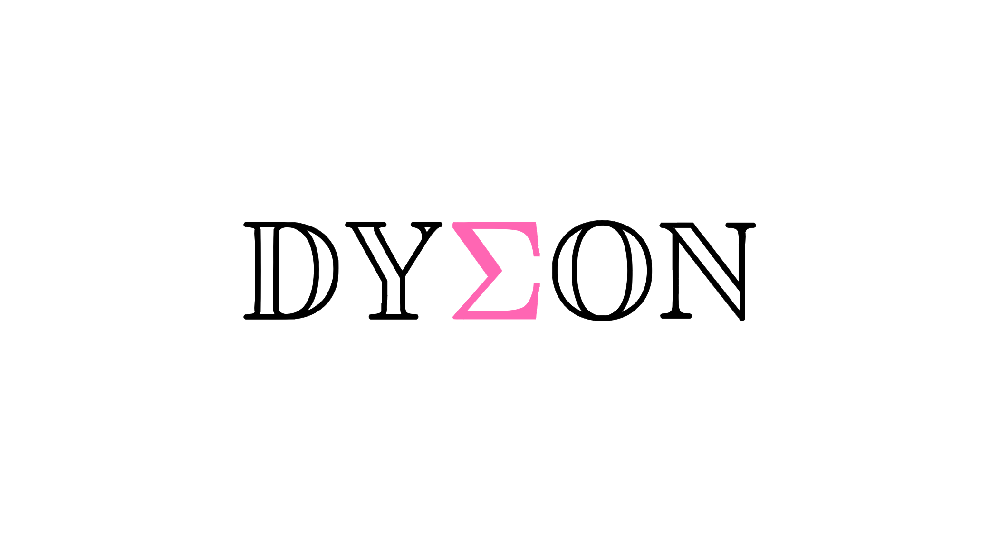

```@raw html

```

*Dyson's equation solver for the Zen computation framework*

!!! info

    Thank you for using Dyson. This documentation will help you to be familiar with and explore the Dyson code. It is just compatible with Dyson v0.7.5-devel.250326.

!!! warning

    The Flink toolkit is in heavy development. Please use it at your own risk. If you encounter any bugs or troubles, or require new features, please consult me directly: **huangli at caep.cn**
