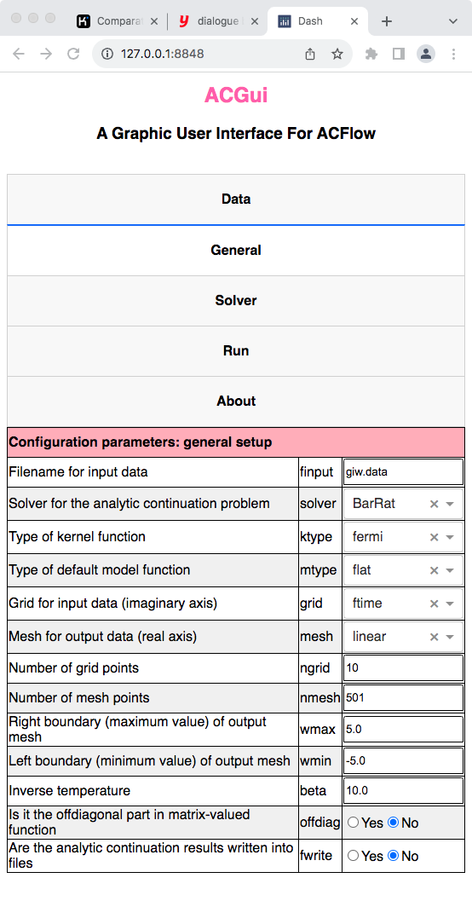
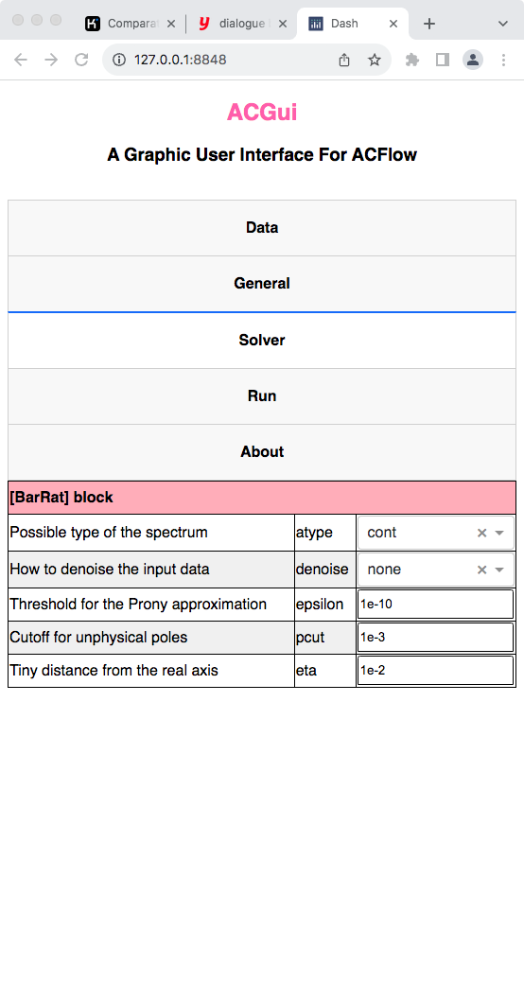
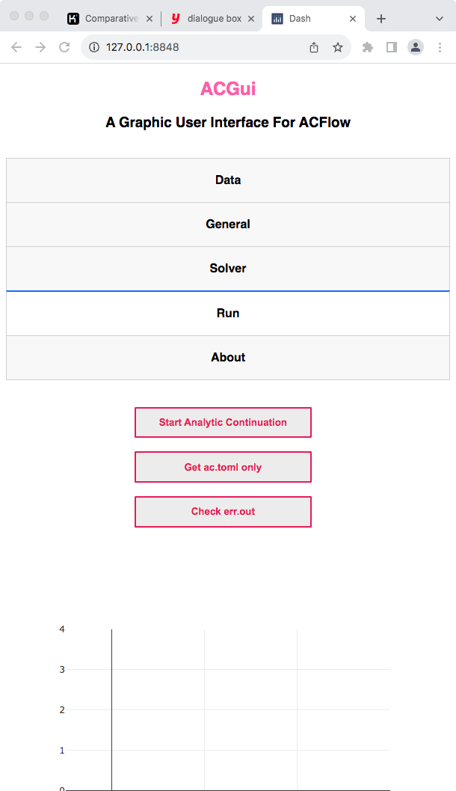

It is quite easy to use `ACGui`.

---

## Boost Server Side

Suppose that the `ACGui` toolkit is placed in the folder `/home/your_home/acgui`, then we should execute the following command in the terminal to launch the server side of `ACGui`:

```shell
$ pwd
/home/your_home/acgui
$ ./util/acg.jl
[ Info: Listening on: 127.0.0.1:8848, thread id: 1
```

---

## Launch Client Side

Next, we can use any favourite web browsers (such as Chrome, Edge, or Firefox) to open the following URL:

```text
http://127.0.0.1:8848
```

This is the client side of `ACGui`.

---

## Prepare Input Data

* Select the `Data` tab.
* Click `Drag and Drop or Select Files`.
* Choose a appropriate file that contains the necessary data.
* Click `Open` in the pop-up dialogue box.

After a few seconds, the data will be uploaded to the server side. Note that the data file will be stored in the working directory in the server side.


**Figure 1 |** The `Data` tab in `ACGui`.

---

## General Setup

* Select the `General` tab.
* Fix filename for input data by `finput`.
* Choose suitable analytic continuation solver by `solver`.
* Fix other parameters if necessary.



**Figure 2 |** The `General` tab in `ACGui`.

---

## Configure Analytic Continuation Solver

* Select the `Solver` tab.
* Customize the parameters for the chosen solver.



**Figure 3 |** The `Solver` tab in `ACGui`.

---

## Run Analytic Continuation Solver

* Select the `Run` tab.
* Click `Start Analytic Continuation` to start calculation. After a few seconds or minites or hours (it depends on the solver you used), the spectrum will be shown in the bottom of this tab.
* Click `Get ac.toml only` to download the generated `ac.toml` file. Later you can modify it and start analytic continuation calculation manually.
* Click `Check err.out` to check the `err.out` file if available. If `ACFlow` encounters something wrong, it will write the error message into `err.out`.



**Figure 4 |** The `Run` tab in `ACGui`.

!!! warning

    To make `ACGui` works correctly, you have to make sure `ACFlow` and `ACGui` are installed correctly, or the relevant environment variables (I mean `ACFLOW_HOME` and `ACGUI_HOME`) are set correctly.

!!! info

    The `MaxEnt` and `BarRat` solvers are highly efficient. So we can see the analytic continuation results very soon. However, the other stochastic solvers are quite slow. It is not a good idea to launch them directly through `ACGui`. We usually use `ACGui` to generate a valid `ac.toml`. Then we can submit the computational job manually.

!!! warning

    Now `ACGui` does not support parallel calculation. In other words, you can not execute the `StochAC`, `StochSK`, `StochOM`, and `StochPX` solvers with multiple processors at the same time.

## Stop Server Side

* Press `CTRL+C` in the terminal, then the client side will stop to respond.

---

## Change Internet Port

The default HTTP port is 8848, but you can modify it by the following steps:

* Open `acgui/src/base.jl` with any favorite editor.
* Go to line 34, and change 8848 to any positive number between 1 and 65535 you wish.
* Please stop and restart the server side to make it work.

```julia
# Start the server
run_server(
    app,
    Dash.HTTP.Sockets.localhost,
    8848, # Change it
    debug = false
)
```
