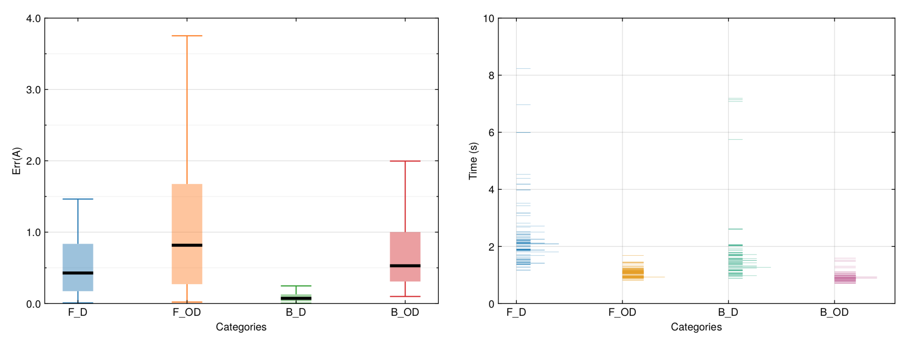

!!! info

    In the **actest/test** directory, there are twelve typical test cases. Users can modify them to meet their requirements. This section will use an independent example to demonstrate the basic usage of the ACTest toolkit.

Next, we have to add a **[Solver]** section in the **act.toml** file to setup the control parameters for the MaxEnt analytic continuation solver (which implements the maximum entropy method) in the ACFlow toolkit. The spirit of the maximum entropy entropy is to figure out the optimal ``A``, that minimizes the following functional:
```math
\begin{align}
Q[A] = \frac{1}{2}\chi^2[A] - \alpha S[A].
\end{align}
```
Here, ``\chi^{2}`` is the so-called goodness-of-fit functional, which measures the distance between the reconstructed Green's function and the original Green's function. ``S`` is the entropic term. Usually the Shannon-Jaynes entropy is used. ``\alpha`` is a hyperparameter. In this example, we adopt the chi2kink algorithm to determine the optimized ``\alpha`` parameters. The list of the ``\alpha`` parameters contains 10 elements. The initial value of ``\alpha`` is ``\alpha_1 = 10^{12}``, and the ratio between two consecutive ``\alpha`` parameters (``\alpha_i / \alpha_{i+1}``) is 10. The complete **[Solver]** section is shown as follows:
```toml
[Solver]
method = "chi2kink" # Method to optimize the \alpha parameter
stype  = "sj"       # Typer of the entropic term
nalph  = 12         # Number of \alpha parameter
alpha  = 1e12       # Initial value of \alpha
ratio  = 10.0       # Ratio between two successive \alpha parameters
blur   = -1.0       # Whether we should broaden the kernel
```
Please execute the following command in the terminal:
```shell
$ actest/util/acflow.jl act.toml
```
It will launch the ACFlow toolkit to perform analytic continuation calculations and generate a lot of output files. In addition to the **Aout.data.i** file, perhaps the most important file is **summary.data**. It records the error, status (pass or fail), and duration time for each test. So, we visualize the **summary.data** file in Figure **1**. It is evident that the errors for the analytic continuations of non-diagonal Green's functions [i.e., scenarios (2) and (4)] are slightly larger than those of diagonal Green's functions [i.e., scenarios (1) and (3)]. Furthermore, scenarios (2) and (4) consume much less time to solve the problems. Surprisingly, we found that the pass rates for scenarios (1) and (3) are approximately 80%, while those for scenarios (2) and (4) are close to 100%. If we further change the computational configurations (such as increasing the size of the dataset, altering the noise level or changing the type of peaks), and then repeat the aforementioned tests, the final conclusions could be similar.



**Figure 1 |** Tests of the maximum entropy method as implemented in the ACFlow package. The tests are classified as four categories (scenarios): (1) F\_D, (2) F\_OD, (3) B\_D, and (4) B\_OD. Here, **F** means fermionic systems and **B** means bosonic systems. **D** means diagonal Green's functions [``A(\omega) > 0``] and **OD** means off-diagonal-like Green's functions [``A(\omega)`` is non-positive definite]. Each category contains 100 tests. In this figure, the information contained in the **summary.data** file is visualized. (Left) Box-and-whisker plot for error statistics. The black solid segments denote the median values. (Right) Histogram plot for duration times consumed in the tests.

!!! note

    Please read the comments in the head of the **acflow.jl** script carefully for detailed usage.
