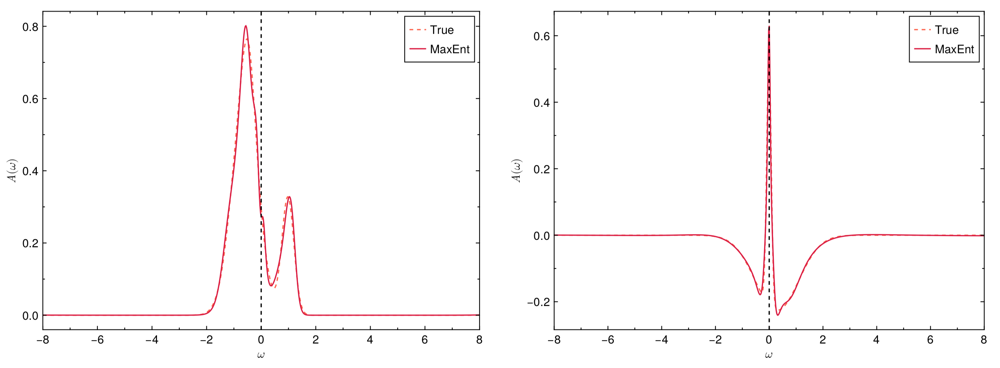
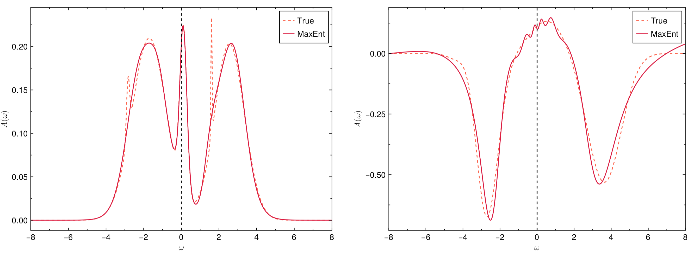

!!! info

    In the **actest/test** directory, there are twelve typical test cases. Users can modify them to meet their requirements. This section will use an independent example to demonstrate the basic usage of the ACTest toolkit.

Finally, we can utilize the **acplot.jl** script to generate figures for the spectral functions. To achieve that effect, please execute the following command in the terminal:
```shell
$ actest/util/acplot.jl act.toml
```
These figures are in standard PDF format. They are used to analyze the differences between the true spectral functions ``A_{\text{true}}(\omega)`` and the calculated spectral functions ``A_{\text{calc}}(\omega)``. Figures **1** and **2** illustrate the spectral functions of typical fermionic systems and bosonic systems, respectively. As can be seen from the figures, aside from some very sharp peaks, the calculated spectral functions agree quite well with the true ones.



**Figure 1 |** Selected analytic continuation results for Matsubara Green's functions (fermionic systems). (Left) Spectra for diagonal Green's function. (Right) Spectra for off-diagonal-like Green's function. The exact spectra are generated randomly by the ACTest toolkit. The vertical dashed lines denote the Fermi level.



**Figure 2 |** Selected analytic continuation results for Matsubara Green's functions (bosonic systems). (Left) Spectra for diagonal Green's function. (Right) Spectra for off-diagonal-like Green's function. The exact spectra are generated randomly by the ACTest toolkit. The vertical dashed lines denote the Fermi level.

!!! note

    Please read the comments in the head of the **acplot.jl** script carefully for detailed usage.
