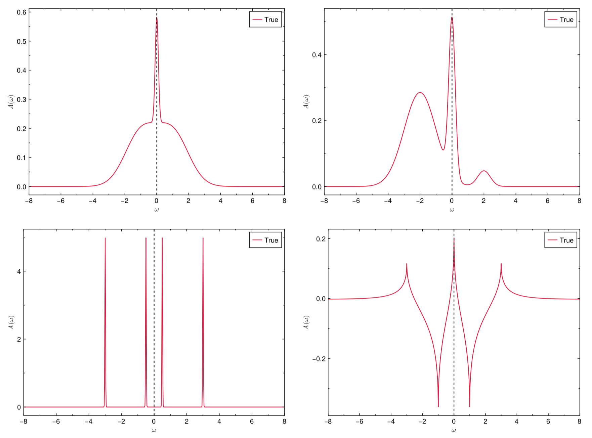

The ACTest toolkit operates in two modes. On one hand, ACTest can randomly generate a large number of spectral functions and Green's functions. People can use them to train or examine machine learning models for solving analytic continuation problems. On the other hand, ACTest includes a **standard** testing dataset. This dataset comprises 100 representative tests, 50 for fermionic systems and 50 for bosonic systems. Hence we name it the **ACT100** dataset. In this dataset, the spectral functions are constructed with predefined parameters (it means that all the peaks and features in these spectra are certain), so they are reproducible. Note that users can only change the grids and the noise levels of the synthetic Green's functions. The basic configurations regarding the fermionic subset of the ACT100 dataset are shown in Table **1**. As for the bosonic subset, the basic configurations are identical. The only difference is the use of bosonic kernels to generate the Green's functions. Four typical spectral functions in the ACT100 dataset are illustrated in Figure **1**.

The ACT100 dataset can be utilized to assess the accuracy of various analytic continuation methods. The question is how to measure the accuracy. Supposed that the true spectral function and the calculated spectral function are ``A_{\text{true}}(\omega)`` and ``A_{\text{calc}}(\omega)``, respectively, their difference can be calculated by the following expression:

```math
\begin{align}
\text{Err}(A_{\text{true}},A_{\text{calc}}) =
\int^{\omega_{\text{max}}}_{\omega_{\text{min}}} d\omega~
{\Large |}A_{\text{true}}(\omega) - A_{\text{calc}}(\omega){\Large |}
~/
\int^{\omega_{\text{max}}}_{\omega_{\text{min}}} d\omega~
{\Large |}A_{\text{true}}(\omega){\Large |}.
\end{align}
```

It is evident that the smaller the value of Err(``A_{\text{true}},A_{\text{calc}}``), the better. Thus, the accuracy of an analytic continuation method can be evaluated by:

```math
\begin{align}
f = \sum^{N_{\text{test}}}_{i = 1}
\theta\left[1 - \text{Err}\left(A^i_{\text{true}},A^i_{\text{calc}}\right)\right]
\left[1 - \text{Err}\left(A^i_{\text{true}},A^i_{\text{calc}}\right)\right].
\end{align}
```
Here, ``N_{\text{test}}`` is the number of tests, ``i`` is the index, ``\theta(x)`` is the Heaviside step function. It is obvious that ``\text{max}(f) = N_{\text{test}}`` and ``\text{min}(f) = 0``.


|System    | Spectrum's type       | Peak's type    | Number of peaks | Number of spectra / tests |
| :------- | :-------------------: | :------------: | :-------------: | :-----------------------: |
|Fermionic | Continuum spectrum,   | Gaussian       | 1               | 3                 |
|          | ``A(\omega) \ge 0``   |                | 2               | 7                 |
|          |                       |                | 3               | 10                |
|Fermionic | Discrete spectrum,    | Gaussian       | 1               | 5                 |
|          | ``A(\omega) \ge 0``   |                | 2               | 5                 |
|          |                       |                | 3               | 2                 |
|          |                       |                | 4               | 3                 |
|          |                       |                | 5               | 3                 |
|          |                       |                | 6               | 2                 |
|Fermionic | Continuum spectrum,   | Rise-And-Decay | 1               | 1                 |
|          | ``A(\omega)`` is non-positive definite | | 2             | 5                 |
|          |                       |                | 3               | 2                 |
|          |                       |                | 4               | 1                 |
|          |                       |                | 5               | 1                 |

**Table 1 |** Basic configurations about the fermionic subset in the ACT100 dataset. Clearly, the fermionic subset is classified into three parts. Both the first and the second parts are for diagonal Green's functions, where ``A(\omega)`` is positive. Their spectra are continuum and discrete, respectively. In the third part, ``A(\omega)`` is non-positive definite and continuum. The configurations for the bosonic subset are the same. It is also classified into three parts according to positive definiteness of ``\tilde{A}(\omega)`` [``\equiv A(\omega)/\omega``]. Full parameters for constructing these spectra are defined in **actest/src/dataset.jl**.



**Figure 1 |** Four representative spectra in the ACT100 dataset. The vertical dashed lines denote the Fermi level. The raw data and figures are generated by the **actest/util/acstd.jl** and **actest/util/acplot.jl** scripts, respectively.
