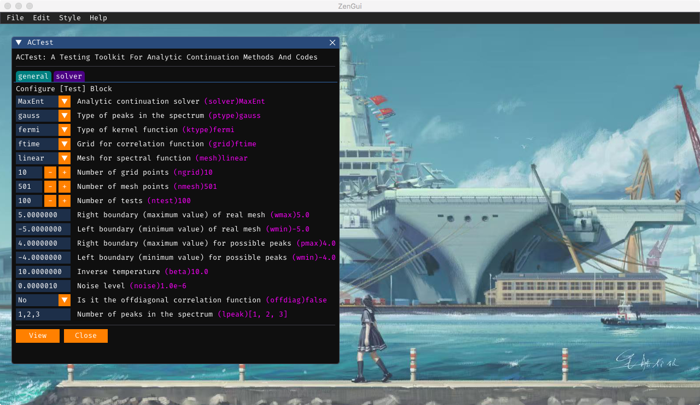
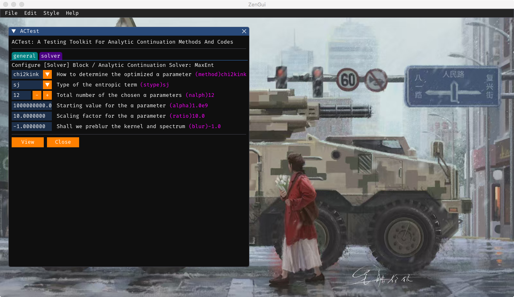

## ZenGui

[ZenGui](https://github.com/huangli712/ZenGui) provides a graphic user interface for ACTest. It is based on the `Dear ImGui` C++ library and its Julia language wrapper `CImGui.jl`. With ZenGui, users can easily generate valid "act.toml" files. See [Inputs](input.md) for more details.

**Figure 1 |** The `ACTest` window 1 in the ZenGui app.

**Figure 2 |** The `ACTest` window 2 in the ZenGui app.

!!! note

    The ZenGui app can be used to generate essential configuration files only. It can not launch the ACTest toolkit to perform calculations.
