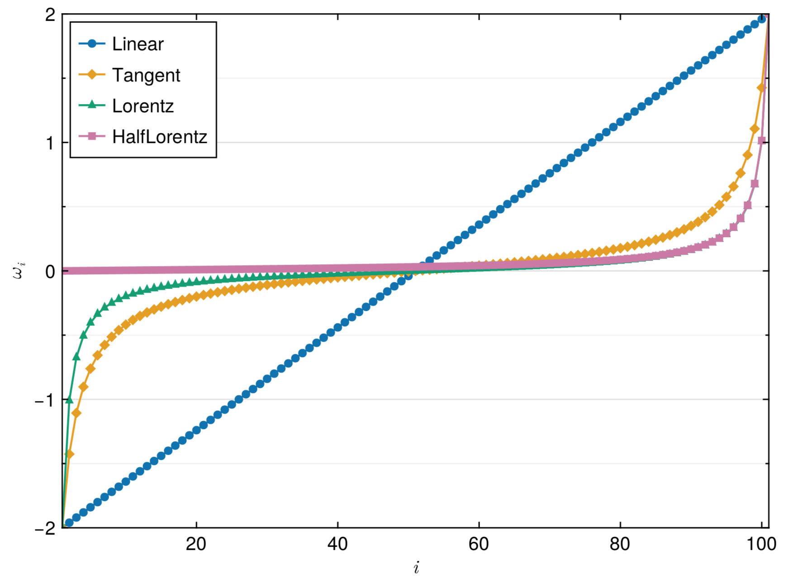

The spectral function ``A(\omega)`` is defined on the real frequency axis. The frequency range for ``\omega`` is restricted in ``[\omega_{\text{min}}, \omega_{\text{max}}]``, where ``N_{\omega}`` represents the number of mesh points, ``\omega_{\text{min}}`` and ``\omega_{\text{max}}`` denote the left and right boundaries of the mesh, respectively. Currently, the ACTest toolkit supports four types of meshes: linear, tangent, Lorentzian, and half-Lorentzian meshes. The latter three meshes are non-linear, with the highest grid density near ``\omega = 0``. As its name suggests, the half-Lorentzian mesh is only suitable for cases where ``\omega \ge 0``. Figure **1** illustrates typical examples of the four meshes.

**Figure 1 |** The four frequency meshes supported in ACTest: linear, tangent, Lorentzian, and half-Lorentzian meshes. The parameters for these meshes are ``\omega_{\text{max}} = -\omega_{\text{min}} = 2.0`` and ``N_{\omega} = 101``.
