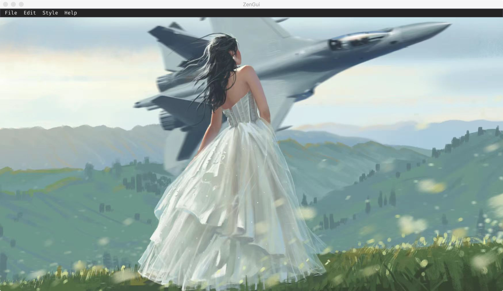
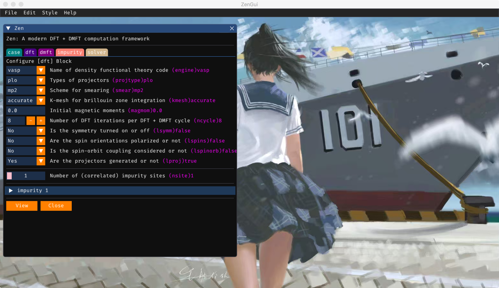
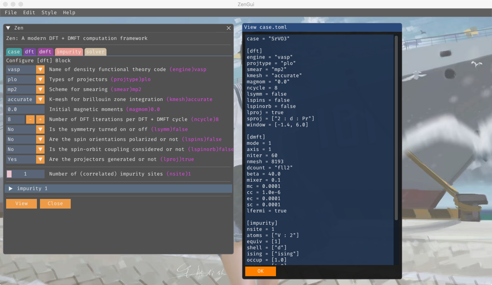
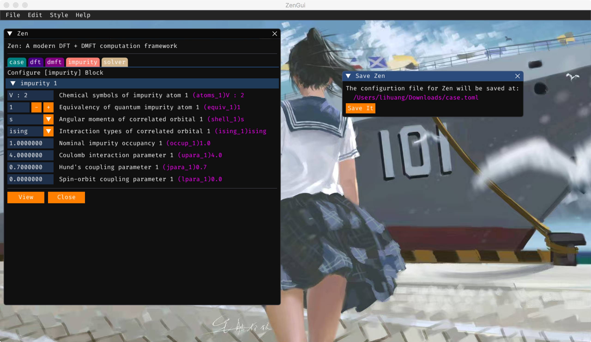

## Launch The GUI

At first, you should lanuch the GUI. Please execute the following command in the terminal:
```
$ zengui/util/zeng.jl
```
Then you can see the main GUI (see **Figure 1**).



**Figure 1 |** Main GUI for the ZenGui app.

The ZenGui is a *menu*-driven GUI. It has four menu groups: *File*, *Edit*, *Style*, and *Help*.

## Change Window's Style

Please click the menus in *Style* one by one to see what will happen. Now ZenGui supports three color styles: classic, dark, and light. You can change the background image of main window as well.

## Seek Helps

Please use the menu group *Help*. The ZenGui will invoke the default web browser of the OS to open the official documentation for the codes you are interested in.

## Edit Configuration Files

Please use the menu group *Edit*. For example, if we want to configure the *Zen* package, please click *Edit -> Integrated Package -> Zen*. Then ZenGui will popup a new window. It looks like as follows (see **Figure 2**):



**Figure 2 |** The GUI for the Zen package.

At this window, we can setup the parameters for the Zen package easily. Be careful, there are five tabs (*case*, *dft*, *dmft*, *impurity*, and *solver*) in this window. They are related to the five blocks in the configuration file for the Zen package (*case.toml*). So please click them one by one, and check whether all of the parameters are reasonable and valid. If you want to have a look at the configuration file, please click the *View* button at the bottom of this window. Then ZenGui will popup a new **Preview** window. It looks like as follows (see **Figure 3**):



**Figure 3 |** The **Preview** window for the Zen package.

## Save Configure Files

Well, if every parameters is correctly setup. Now we can try to generate the configuration file and save it.

At first, please make sure that the configure window for the code is activated (on front of any other windows). This is quite important.

Second, please click the menu *File -> Save*. Then a new window is shown (see **Figure 4**). It tells us the path for the generated configuration file. Please click the *Save It* button. Then you can find the generated configuration file **in the current directory**.



**Figure 4 |** The **Save It** window for the Zen package.

## Close ZenGui

Please click the *File -> Exit* menu.

!!! warning

    Now the iQIST/cthyb code is not yet supported.

!!! warning

    Sometimes, the configuration files generated by ZenGui might be not compatible with the codes. If happens, please consult with us as soon as possible. Thank you very much.
